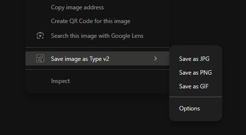
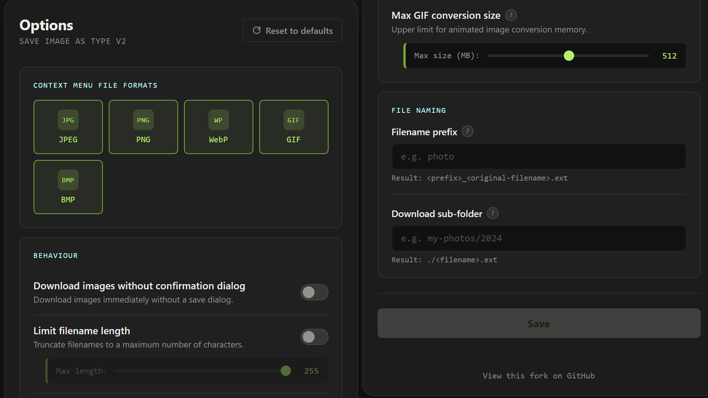
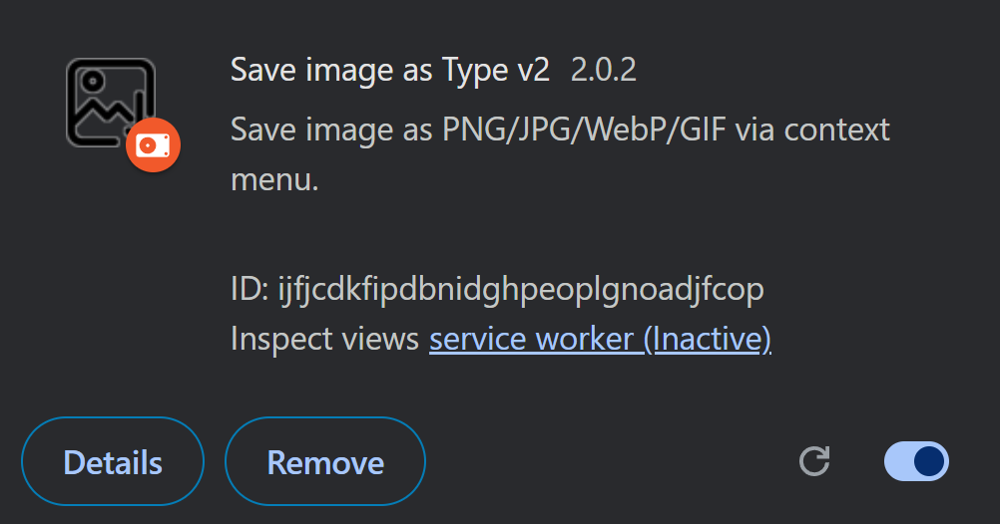

#  *Save Image as Type* v2
Fork of [src](https://github.com/image4tools/Save-Image-as-Type) (*authored by image4tools which has since been removed, read more below*).

## About
Tired of having saved images as _.webp_ type? **Save Image as Type v2** is a Chrome extension which adds an option _"Save as PNG/JPG/WebP/GIF/BMP"_ to the context menu on right-clicking any image. 

The original extension was removed from the Chrome Web Store for [containing spyware](https://www.xda-developers.com/google-featuring-chrome-extension-months-malicious/) (thanks **@Adam Conway** for the detailed write-up!). This fork is the successor that's 100% local, with zero tracking, zero analytics, and no external servers or injection scripts. All processing happens locally in your browser. The extension is extremely lightweight at roughly 220 KB!

## Supported Formats
* **PNG, JPG, WebP:** native HTML5 Canvas conversion.
* **BMP:** 32-bit BMPs with transparency support.
* **GIF:** convert animated WebP & APNG files.
* *Note: AVIF support is excluded as it would require bundling a WebAssembly encoder.*

  

## Extension Options
There are various options you can customize via the options page:
* Toggle which formats appear in the right-click menu.
* Enable instant downloading (skips the "Save As" dialog).
* Set default filename prefixes.
* Define download sub-folders.
* Limit maximum filename lengths.
* Set a memory limit for GIF conversions.

## "Access to all" permission
This extension requires the `<all_urls>` permission, which Chrome displays as _"Read and change all your data on all websites"_. 

Sadly, it has to be used to bypass CORS restrictions, otherwise the extension would fail reading pixel data from images hosted on some popular CDNs (like _Google User Content_).

## Installation
1. Go to [`chrome://extensions/`](chrome://extensions/)
2. Enable `Developer mode` (upper right corner)
3. Select `Load unpacked` in the upper left corner and select the extracted extension folder.  
The extension should be installed successfully.  

## Acknowledgments
* Rob Wu: https://github.com/Rob--W
* Cuixiping: https://github.com/cuixiping
* jnordberg: https://github.com/jnordberg/gif.js

## License
This project is licensed under the GNU General Public License v2.0.